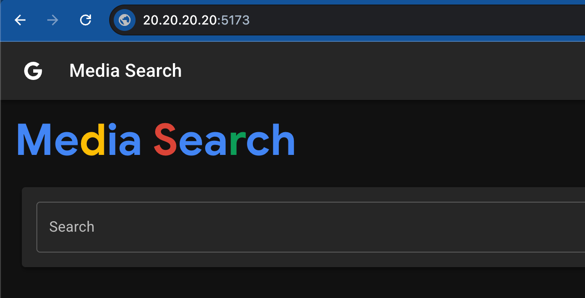

# Project Momentum \- Pilot Environment Setup

These instructions will walk through and explain the setup of a GCP environment for the Project Momentum pilot as well as installing the pilot application itself.

## Google Cloud Environment Setup

The Google Cloud Shell will be used for this setup so make sure you have access to it.

### Variables 

These are used in this text, change these values to whatever matches your environment.

**Project ID:** `media-search-pilot`  
**VM Name:** `media-search-server`  
**Zone:** `us-central1-b`  
**VPC Name:** `myvpc`  
**Subnet Name:** `mysub`  
**Release:** `release-latest`   
**High Res Bucket:** `my-high-res`   
**Low Res Bucket:** `my-low-res`

### Create Project (if needed)

Create a new project from the Google Cloud Console or from the Cloud Shell using these commands:

```
export PROJECT="media-search-pilot"
export ACCOUNT_ID=$(gcloud billing accounts list --format="value(ACCOUNT_ID)" --limit=1)

gcloud projects create $PROJECT
gcloud config set project $PROJECT
gcloud billing projects link $PROJECT --billing-account=$ACCOUNT_ID
```

### Download Application Repository

In the Cloud Shell, download and unzip the latest release of the application. 

```
mkdir ./media-search
curl -L https://github.com/jaycherian/gcp-go-media-search/archive/refs/tags/release-latest.tar.gz | tar -xz --strip-components=1 -C ./media-search
```

Now switch into the unzipped folder and follow the rest of the instructions from this folder:

```
cd ./media-search
```

### Enable APIs

**NOTE**: This pilot requires external access to the VM running the application. If you’re running in a restricted environment such as **Argolis**, you’ll need to reset this org policy.

Run this command from the Cloud Shell:

```
gcloud org-policies reset compute.vmExternalIpAccess --project $GOOGLE_CLOUD_PROJECT
```

Before enabling APIs you can list out which APIs are already enabled:

```
gcloud services list --filter="STATE:ENABLED" --format="value(NAME,STATE)"
```

The following script will enable the Google Cloud APIs we’ll need for this app, namely:

- `aiplatform.googleapis.com`  
- `cloudresourcemanager.googleapis.com`  
- `compute.googleapis.com`  
- `iam.googleapis.com`  
- `pubsub.googleapis.com`  
- `storage.googleapis.com`

```
./deploy/scripts/enable-apis.sh
```

**NOTE**: Within this script we are creating the Vertex AI Service Agent which does not get created by default when enabling the API. We will also grant that service agent the roles it will need for the application.

### Run Terraform

We’ll use terraform to provision cloud resources that the application requires and install the server code on the VM that will run it.

Change into the terraform directory:

```
cd ./deploy/terraform
```

Now we can initialize and run `terraform apply` with the following variables that we need to specify:

- `project_id` \- You project id  
- `high_res_bucket` \- The name of the storage bucket to hold high res video  
- `low_res_bucket` \- The name of the storage bucket to hold low res video  
- `vpc_name` \- (optional) The name of an existing VPC (if not specified, a new one will be created)  
- `subnet_name` \- (optional) The name of an existing subnet (if not specified, a new one will be created)  
- `release` \- (optional) The name of the release to use (if not specified, the latest release will be used)

**NOTE**: If you’re not using the optional variables above, just remove them from the command below.

Run the following terraform commands:

```
terraform init
terraform apply \
  -var 'project_id=media-search-pilot' \
  -var 'high_res_bucket=my-high-res' \
  -var 'low_res_bucket=my-low-res' \
  -var 'vpc_name=myvpc' \
  -var 'subnet_name=mysub' \
  -var 'release-latest'
```

If you want to ssh to the server VM and have a look around, use this command from the Cloud Shell:

```
gcloud compute ssh media-search-server --zone us-central1-b
```

## Media Search App Install

We have created the `media-search-server` VM with a startup script that will do the following on the first start of the VM and other things on every start of the VM.

**NOTE:** This section is for **REFERENCE ONLY**.

### First VM Start

**NOTE:** **DO NOT** run these commands, they are for reference only.

The first time the VM boots up, it will install the server code and configure it.

**NOTE**: The application code is installed in the `/opt/media-search` directory.

This script will install the needed applications, namely: **golang**, **npm** and **ffmpeg**:

```
bash -c "$(curl -fsSL https://raw.githubusercontent.com/jaycherian/gcp-go-media-search/refs/tags/release-latest/deploy/scripts/setup-server.sh)"
```

Then it will download the application and unzip it into `/opt/media-search` directory:

```
mkdir -p /opt/media-search
curl -L https://github.com/jaycherian/gcp-go-media-search/archive/refs/tags/release-latest.tar.gz | tar -xz --strip-components=1 -C /opt/media-search

```

Then it will create the .toml file that holds our golang environment variables. 

The file: `/opt/media-search/backend/go/configs/.env.local.toml` will look like this: 

```
[application]
google_project_id = "media-search-pilot"
signer_service_account_email = "media-search-sa@media-search-pilot.iam.gserviceaccount.com"

[storage]
high_res_input_bucket = "my-high-res"
low_res_output_bucket = "my-low-res"
```

### Every VM Start

**NOTE:** **DO NOT** run these commands, they are for reference only.

First we update all packages:

```
sudo apt update && sudo apt upgrade -y && sudo apt autoremove -y
```

Then we start the frontend and backend servers together:

```
(cd /opt/media-search && ./start_both.sh) > /var/log/media-search-app.log 2>&1 &
```

Server output is sent to these files:

- `/var/log/media-search-frontend.log` \- Output from the frontend VIPE server  
- `/var/log/media-search-backend.log` \- Output from the backend go server  
- `/var/log/media-search-app.log` \- Output from starting up the servers

### Media Search App Usage

Now we’re ready to access the Media Search application in a browser.

Get the external IP of the application VM with this command:

```
gcloud compute instances describe media-search-server --zone=us-central1-b  --format='get(networkInterfaces[0].accessConfigs[0].natIP)'
```

Assuming your IP is: **20.20.20.20**

Browse to this URL: <http://120.120.2.2:5173>

You should see this UI:



